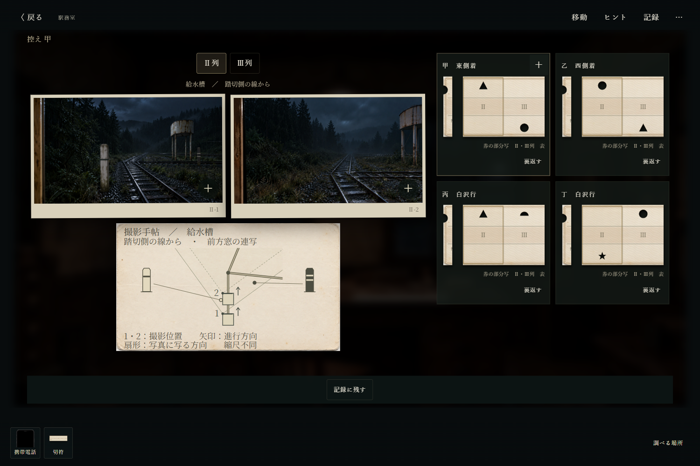
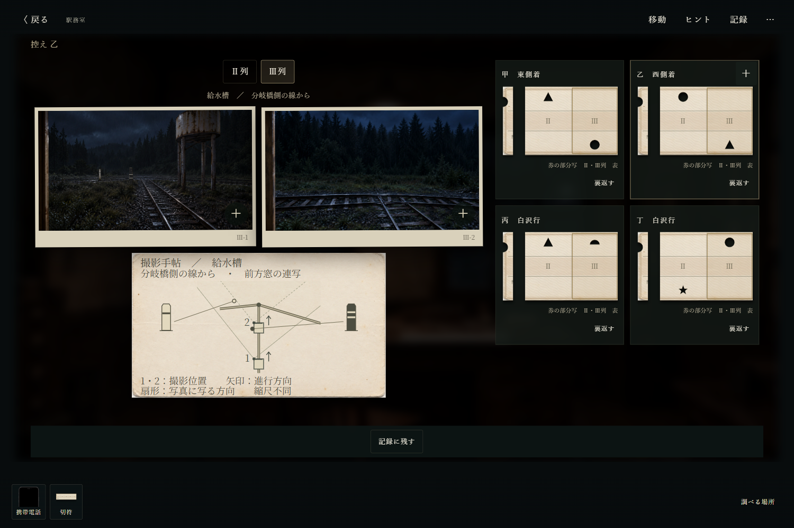

# 切符の縁の観察根拠 — 2026-10-03

素材整理後は、この資料から参照する代表画像8枚を保持。未参照の追加キャプチャは削除した。

## 修正前に成立しなかった点

「柱が窓の左右のどちらにあるか」は現在の判定の規則ではなかった。同じ白い一本帯が写真左にも右にも現れ、黒い二本帯も左右に現れる。給水槽A進入の二枚目では、白柱はカメラより後方、黒柱はまだ前方だが右画角外となる。消えたという事実だけでは区別できない。

さらに保守小屋では、二つの標柱が両方とも連写の間にカメラの後ろへ移る配置だった。対象の黒柱についてのみ前後を検査しても、別の白柱を除外できていなかった。ヒントも、この連写と部分写しには存在しない「前後で増えた穴」を指していた。入場時の写真並べ替えの規則と混同していた。

見本からの規則発見は残す。一方、帰路の各進入線でどの標柱を使うのかは、一地点だけに付いた操作札や断片的な遠景から一様に検証できなかった。

## 現行資料でできる判断

### 見本からの規則発見

乗車券控の写真に、撮影手帖（前方窓・撮影位置1/2・進行方向・水平画角・線路・標柱位置）を添えた。手帖はカメラ/標柱の共通座標で描画し、通った柱の答えを選択表示しない。二枚の間に通った柱と、その列の加工済みの穴を比較する。

- 甲Ⅱ・給水槽: 一本帯の白柱は位置1と2の間。二本帯の黒柱は位置2より前方で、二枚目の画角の右外。Ⅱ列の三角穴は切欠きに近い縁。
- 乙Ⅲ・給水槽: 二本帯の黒柱が位置1と2の間。白柱はまだ前方で左画角外。Ⅲ列の三角穴は切欠きから遠い縁。
- 同じ給水槽の穴の形を固定して比較することで、一本帯/二本帯と縁の対応を得られる。丙の鉄塔や丁の分岐橋は白柱が写真右にある反例なので、「写真左なら近い」という仮説では全見本に合わない。
- Cの別線の白柱は写真1より前に通り過ぎる位置へ移した。写真1から2の間に通るのは黒柱だけとなり、丁Ⅱの遠い縁と対応する。

### 決めた帰路への適用

観察先は北ホームの分岐操作器。各レバーの札を拡大し、中央を今から通る地点、周囲をその線の接続先として読む。「各線から中央へ入る際の標柱」の見取に、一本帯/二本帯が付いている。レバーの位置を変えても固定の標柱は変わらない。未確認の接続先の「？」は残すため、路線接続の観察は別途必要。

|帰路の地点|観察する札と進入線|観察内容|見本との比較による縁|
|---|---|---|---|
|踏切（菱形）|中央が菱形、駅からの線|白い一本帯|切欠きに近い|
|給水槽（三角形）|中央が三角形、菱形からの線|白い一本帯|近い|
|分岐橋（丸形）|中央が丸形、三角形からの線|黒い二本帯|遠い|
|坑口（長方形）|中央が長方形、帰路の観察で丸形につながると特定した「？」の線|白い一本帯|近い|
|鉄塔（半円形）|中央が半円形、長方形からの線|黒い二本帯|遠い|

もう一つの帰路、踏切→保守小屋→分岐橋を選んだ場合、星形の札の菱形側は二本帯なのでⅡ列は遠い縁、丸形の札の星形側は一本帯なのでⅢ列は近い縁になる。共通する踏切・坑口・鉄塔は同じ。出る側の線の柱を読むと、とくに踏切・鉄塔で別の結果となり、控えとの対応を満たさない。

札の実画面: [踏切](verification/2026-10-03-ticket-edges/edge-point-A.png)・[給水槽](verification/2026-10-03-ticket-edges/edge-point-B.png)・[保守小屋](verification/2026-10-03-ticket-edges/edge-point-C.png)・[鉄塔](verification/2026-10-03-ticket-edges/edge-point-D.png)・[分岐橋](verification/2026-10-03-ticket-edges/edge-point-E.png)・[坑口](verification/2026-10-03-ticket-edges/edge-point-F.png)。

## 検証と限界

PCでは四控えの各二列と六札を通常操作で開き、上記の根拠が描画されることを確認。390pxのタッチ環境では、写真拡大・二枚表示への復帰・列切替・表裏・記録・保存再読込を確認。札は全六地点で画面内に収まり、記録して再読込した札にも標柱が残る。実行時例外0。写真と札を追加で読んだこと自体は乗車条件にしない。

自動テストは、受理判定から独立した歴史資料を起点に規則を推定してから、操作札の進入線へ適用し、両帰路の券を構成する。どちらも判定を満たし、各縁を一つずつ取り違えた券は判定を満たさない。既存の切符・保存・信号・終幕を含む198テストが成功。

これは作者側の画像読解・操作・整合検証である。内部正解との一致だけで根拠の十分性を断定せず、見える根拠を上記に列挙した。独立した初見ユーザーの再試遊、理解率、難易度の実測は未実施。
